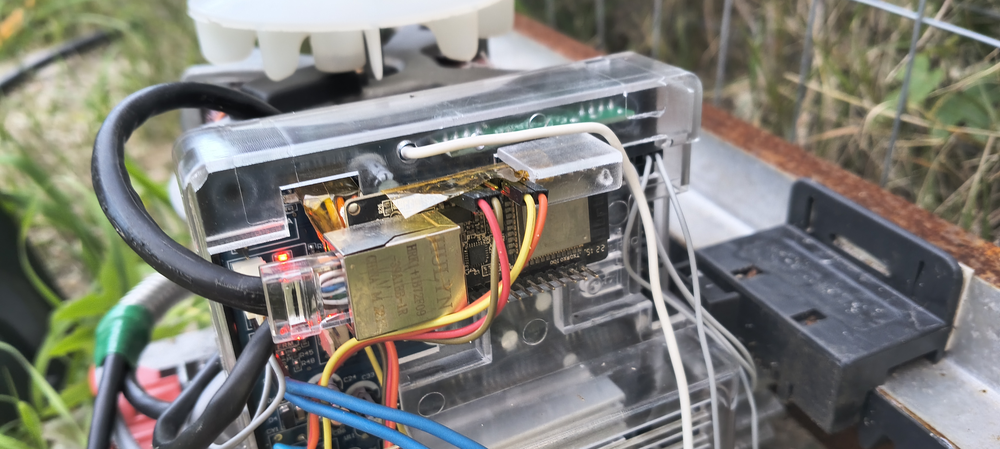

# tuya-esphome-garen
Esphome configuration, using tuya serial protocol, for brazilian "Garen" door controller as found in https://garen.com.br or https://garenuruguay.com.uy

# Hardware
Tested on [Garen TSI-Fit](https://garen.com.br/produto/central-tsi-fit/) and [WT32-ETH01](https://en.wireless-tag.com/product-item-2.html)

